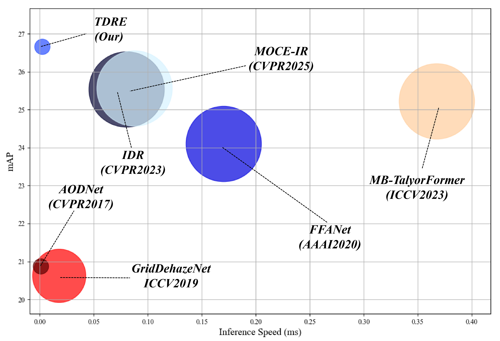

## Bridging the Domain Gap: A Transferable Dynamic Routing Enhancer for Robust Aerial Detection Under Adverse Weather
This is an ultra-lightweight, plug-and-play machine-oriented visual filter specifically designed for Unmanned Aerial Vehicle (UAV) object detection under adverse weather conditions (such as fog, dust, and low illumination). Traditional image restoration networks often suffer from a "Human-Visual Bias," wasting massive computational resources on smoothing backgrounds while inadvertently discarding the high-frequency semantic edges essential for machine perception. TDRE breaks this deadlock through a unique synergistic optimization mechanism and dynamic routing architecture. It significantly boosts the robust generalization of models across complex open-world environments—without altering the weights of the frozen downstream detector.

✨ Key Features
🚀 Ultra-Lightweight & Fast: Introduces fewer than 3K (2,930) additional parameters and merely 0.002s of inference latency, perfectly tailored for compute-constrained edge devices and UAV platforms.

🧠 Dynamic Routing Mixture-of-Experts (DR-MoE): The internal parallel expert networks adaptively disentangle and process diverse, complex atmospheric degradations (Foggy, Dusty, Lowlight) in a single forward pass.

🎯 Task-Driven Synergy: Discards blind global reconstruction by innovatively utilizing spatial masks guided by detection labels. This forces the network to concentrate its limited computational capacity entirely on amplifying high-frequency features in target regions, explicitly resolving the "task inconsistency" problem.

🛡️ Zero-Interference Bypass: Introduces a novel "Clear-Sky Perceptron" acting as a reliable hard gate. It seamlessly bypasses undegraded clear images, fundamentally eradicating the risk of "catastrophic forgetting" caused by domain shifts.

🚀 Quick Start
We have provided a ready-to-run inference script, along with pre-trained weights and sample test data. Simply execute the script below to instantly view the restoration and enhancement results:

```bash
python inference.py
```

## Abstract

## PipLine
 
## Experiment



