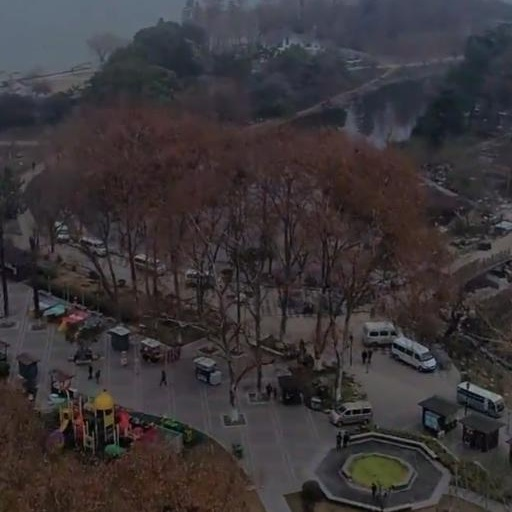
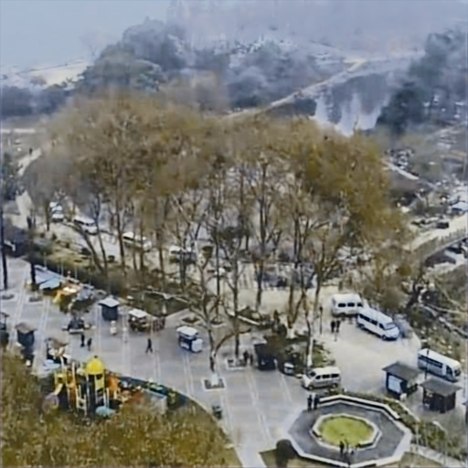
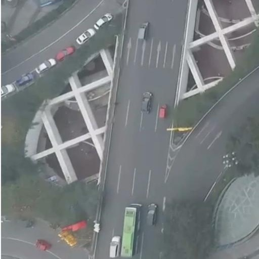
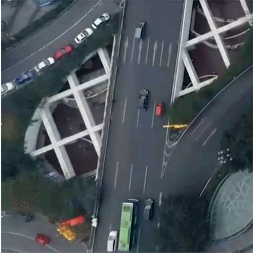
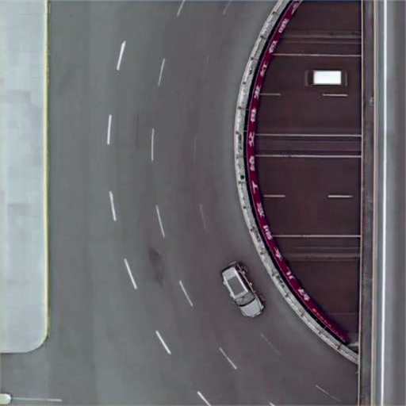

<div align="center">

## TDRE: Transferable Dynamic Routing Enhancer for Robust Aerial Detection Under Adverse Weather

**Accepted by the ISPRS Journal of Photogrammetry and Remote Sensing**

[Paper on ScienceDirect](https://www.sciencedirect.com/science/article/pii/S0924271626004387) | [Repository](https://github.com/KIKYOUWY/TDRE)

<a href="#updates">Updates</a> | <a href="#overview">Overview</a> | <a href="#results">Results</a> | <a href="#checkpoint">Checkpoint</a> | <a href="#quick-start">Quick Start</a> | <a href="#datasets">Datasets</a> | <a href="#citation">Citation</a>

</div>

> TDRE is a plug-and-play enhancer for UAV detection under fog, dust, and low-light conditions. It preserves task-relevant structure and keeps the downstream detector fixed.
> This repository includes the inference code, pretrained checkpoint, and sample outputs for the paper above.

## Updates

- **2026-08:** Paper accepted by the ISPRS Journal of Photogrammetry and Remote Sensing.
- **2026-08:** Released training, inference, and label-visualization code.
- **2026-08:** Added VOC label conversion and CAD-ADD label inspection utilities.

## Overview

TDRE is a lightweight image enhancement framework for UAV object detection under adverse weather. It is built around three stage-wise objectives:

- **Stage 1:** clear-sky gate learning for clear versus degraded images.
- **Stage 2:** dynamic routing with multi-space restoration in RGB, HSV, and LAB.
- **Stage 3:** detection-region masked restoration using VOC bounding boxes.

Key properties:

- Single-image inference with a provided checkpoint.
- Clear, foggy, dusty, and low-light sample inputs.
- Direct saving of the final enhanced output for comparison and reporting.

The model routes foggy, dusty, and low-light images through expert branches, while clear images bypass the routing path directly.

<p align="center">
  
</p>

## Results

TDRE improves aerial detection robustness under adverse weather while staying lightweight and detector-agnostic.

<p align="center">
  
</p>

## Checkpoint

| Item | File | Note |
| --- | --- | --- |
| Pretrained TDRE | `weight/weight.pth` | Provided checkpoint for inference |

## Quick Start

### Installation

```bash
pip install -r requirements.txt
```

### Inference

```bash
python inference.py --weights weight/weight.pth --image example/test_foggy.jpg --save_path example/enhanced_foggy.png
```

The script outputs the original image, the restored image, and the enhanced image. Use `--preview_path` if you also want the three-panel preview saved as a figure.

### Example Results

The following examples show the original input and the final enhanced output produced by TDRE:

| Weather condition | Original input | Enhanced output |
| --- | --- | --- |
| Low-light |  |  |
| Foggy |  |  |
| Dusty |  |  |

### Training

```bash
python train.py --data_root datasets\CAD-ADD --stage all --weights weight/weight.pth
```

Stage summary:

1. Clear-sky gate training.
2. Routing and multi-space restoration training.
3. Detection-region masked restoration training.

### Label Visualization

```bash
python tools/visualize_cadadd_labels.py --count 10 --out_dir results/label_vis
```

This generates four random VOC label sheets, one for each dataset split group.

## Datasets

TDRE expects CAD-ADD in a VOC-style layout.

Dataset download:

- [CAD-ADD.zip](https://pan.baidu.com/s/1aHGkNPtKXIH8fPJkq8Wp6A?pwd=k6yz)  
  Extraction code: `k6yz`

Default local path:

```bash
datasets\CAD-ADD
```

You can also use the original dataset path:

```bash
G:\UAVdata\CAD-ADD
```

Expected structure:

```text
CAD-ADD
|-- Agricultural Detection
|   |-- Clear/{train,test}
|   |-- Foggy/{train,test}
|   |-- Dusty/{train,test}
|   |-- Lowlight/{train,test}
|   `-- Labels/{train,test}/*.xml
|-- Rescue Detection
|   |-- Clear/{train,test}
|   |-- Foggy/{train,test}
|   |-- Dusty/{train,test}
|   |-- Lowlight/{train,test}
|   `-- Labels/{train,test}/*.xml
|-- Waste Detection
|   |-- Clear/{train,test}
|   |-- Foggy/{train,test}
|   |-- Dusty/{train,test}
|   |-- Lowlight/{train,test}
|   `-- Labels/{train,test}/*.xml
|-- Transport Detection
|   |-- Clear/{train,test}
|   |-- Foggy/{train,test}
|   |-- Dusty/{train,test}
|   |-- Lowlight/{train,test}
|   `-- Labels/{train,test}/*.xml
`-- Real Transport Detection
    |-- images
    `-- Labels
```

Annotations are read from VOC `xml` files.

## Citation

Paper link: [ScienceDirect article](https://www.sciencedirect.com/science/article/pii/S0924271626004387)

Please cite the journal article using the metadata shown on the paper page.

## Contact

Email: [2024282140091@whu.edu.cn](mailto:2024282140091@whu.edu.cn)

## Repository Layout

- `TDRE.py`: model definition.
- `losses.py`: all training losses.
- `train.py`: three-stage training pipeline and VOC data loading.
- `inference.py`: single-image inference.
- `tools/visualize_cadadd_labels.py`: random VOC label visualization.
- `tools/convert_rescue_labels_to_voc.py`: YOLO-to-VOC conversion for Rescue Detection.
- `tools/normalize_cadadd_filenames.py`: dataset filename normalization.
- `datasets/CAD-ADD/`: local mirror of the dataset structure.
